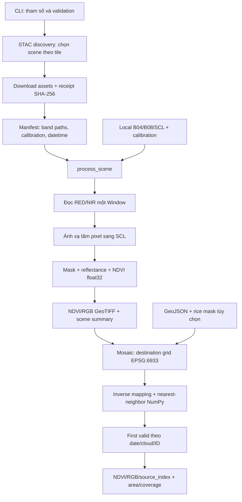

# Study Guide — Từ một pixel vệ tinh đến bản đồ theo vùng

Tài liệu này dành cho người muốn tự giải thích và sửa được pipeline. Hãy đọc cùng mã nguồn, dự đoán kết quả trước khi chạy ví dụ, rồi dùng tests kiểm tra lập luận. Mục tiêu không phải ghi nhớ tên hàm mà là hiểu các bất biến: đúng vị trí, đúng thời gian, đúng đơn vị, không đếm trùng và bộ nhớ không tăng theo toàn bộ diện tích.

## 1. Bắt đầu bằng một bài toán nhỏ

Giả sử một ruộng xuất hiện trong hai ảnh A và B. A chụp đúng ngày cần xem nhưng có mây ở một góc. B chụp hôm sau, góc đó không có mây. Bạn muốn một bản đồ duy nhất và một thống kê diện tích.

Trước khi viết phép chia NDVI, cần trả lời:

1. B04 và B08 có nhìn cùng vị trí mặt đất không?
2. Số 2000 trong TIFF là reflectance hay DN cần scale/offset?
3. Pixel bị mây được coi là 0 hay chưa quan sát được?
4. Nếu hai tile chồng nhau, pixel nào được chọn?
5. Khi ảnh thiếu một phần tỉnh, mẫu số coverage có còn bao gồm phần thiếu không?

Pipeline trả lời lần lượt các câu hỏi này. NDVI chỉ là một mắt xích.

Chạy bài học offline trước:

```powershell
.venv\Scripts\python scripts/demo_pipeline.py
```

Script sinh hai bộ RED/NIR/SCL nhỏ, tạo mây giả ở tile A, dịch tile B sang bên cạnh, tính NDVI, tạo polygon và rice mask giả, rồi mosaic. Đầu ra ở `data/demo/`. Đây là dữ liệu minh họa, không phải ranh giới hành chính hay bản đồ lúa thật. Có thể mở TIFF bằng QGIS để xem `source_index.tif` cùng `ndvi.tif`.

Đọc lần lượt: `src/core/ndvi_engine.py` → `src/io/raster_wrapper.py` → `src/pipeline.py` → `src/core/spatial.py` → `src/mosaic.py` → `src/io/downloader.py` → `src/main.py`.

## 2. Workflow: thành phần nào nói chuyện với thành phần nào?



`main.py` quyết định **làm gì**; module nghiệp vụ quyết định **làm như thế nào**. CLI không chứa vòng lặp pixel. Nhờ đó tests gọi trực tiếp `process_scene` hoặc `mosaic_scenes` mà không cần giả lập terminal.

Có hai hợp đồng dữ liệu quan trọng:

- **Scene manifest** do downloader tạo: `id`, `bands`, `calibration`, `datetime`, `cloud_cover`. Nó mô tả nguyên liệu và nguồn gốc.
- **Scene summary** do pipeline tạo: `scene_id`, đường dẫn NDVI/RGB hoàn chỉnh, ngày chụp, calibration thực dùng và thống kê. Mosaic đọc summary, không đọc các file TIFF tùy ý nằm trong thư mục.

Một chương trình dùng giao diện JSON ổn định dễ chạy bằng scheduler hơn một notebook phụ thuộc thứ tự chạy cell. Nhưng path tuyệt đối trong manifest hiện tại gắn với máy tạo nó: khi di chuyển dataset sang máy khác, cần cập nhật đường dẫn hoặc tạo lại manifest.

### Vai trò của từng nhóm file

| Thành phần | Trách nhiệm | Không nên chứa |
|---|---|---|
| `src/io/downloader.py` | Tìm scene, tải bytes, xác minh cache | Công thức NDVI |
| `src/io/raster_wrapper.py` | Mở raster, metadata, windows | Chính sách chọn ngày |
| `src/core/ndvi_engine.py` | Phép tính và mask vectorized | HTTP, đường dẫn, CLI |
| `src/core/spatial.py` | Pixel centers, sampling, point-in-polygon | Quyết định scene ưu tiên |
| `src/pipeline.py` | Kết nối I/O và NDVI cho một scene | Ghép toàn vùng nhiều ngày |
| `src/mosaic.py` | Lưới chung, priority, provenance, area | Tự đoán bản đồ lúa |
| `src/viz/heatmap_generator.py` | NDVI thành RGB để xem | Kết luận hạn/mất mùa |
| `scripts/` | Entry points, demo, animation, cleanup | Thuật toán sản xuất bị sao chép |
| `tests/` | Dữ liệu nhỏ có đáp án biết trước | Tải hàng GB mỗi lần test |

## 3. Raster, band, pixel và tile là gì?

**Raster** là ma trận có thêm vị trí trên Trái Đất. Một mảng 100×100 không tự cho biết nó thuộc tỉnh nào. GeoTIFF lưu cả mảng, CRS, affine transform, nodata và thông tin khác.

**Band** là một kênh đo. B04 đo ánh sáng đỏ, B08 đo cận hồng ngoại. SCL là nhãn phân loại cảnh, không phải một mức sáng có thể nội suy tùy ý. Giá trị SCL 4 nghĩa là vegetation; 9 là cloud high probability theo hệ phân lớp được pipeline sử dụng.

**Tile** là một mảnh ảnh địa lý. **Scene** gắn mảnh ảnh với một lần quan sát/ngày chụp. Một tile có thể có nhiều scene trong tháng. Chọn một scene cho mỗi tile khác hoàn toàn với lấy tất cả ảnh trong tháng.

**Window/chunk** là hình chữ nhật nhỏ bên trong raster. Rasterio dùng `Window(col_off, row_off, width, height)`; NumPy thường truy cập `array[row, col]`. Đảo hai thứ tự này là lỗi phổ biến.

**CRS** là quy ước diễn giải tọa độ. Cặp `(105, 10)` có thể là lon/lat nếu CRS là WGS84, nhưng sẽ là tọa độ mét rất khác nếu CRS là UTM. Cùng kích thước mảng không có nghĩa hai ảnh coregistered.

### Affine transform: từ hàng/cột sang tọa độ

Với `t = Affine(a, b, c, d, e, f)`:

```text
x = a * col + b * row + c
y = d * col + e * row + f
```

Ảnh north-up thường có `a > 0`, `e < 0`, `b = d = 0`. Hàng tăng khi đi xuống nên hệ số y âm. Pixel center dùng `row + 0.5`, `col + 0.5`; nếu dùng corner, vị trí lệch nửa pixel.

Khi raster xoay, pixel width không còn là `abs(a)`. Độ dài vector cột là `sqrt(a²+d²)`, vector hàng là `sqrt(b²+e²)`. Vì vậy `RasterWrapper.get_pixel_size()` dùng `np.hypot`. Bounds lấy min/max tọa độ của cả bốn góc, xử lý được cả ảnh xoay và đảo trục.

**Tự thử:** sửa transform của raster trong test từ `Affine(3,-4,100,4,3,200)` sang `Affine(-10,0,100,0,10,200)`. Trước khi chạy, hãy tự tính left/right/top/bottom.

## 4. Deep dive I/O: tại sao đọc theo window?

Đoạn lõi trong `RasterWrapper.read_chunk`:

```python
actual_width = min(chunk_size, self.width - col_off)
actual_height = min(chunk_size, self.height - row_off)
w = Window(col_off, row_off, actual_width, actual_height)
chunk = self.src.read(band_index, window=w)
yield(chunk, w, row_off, col_off)
```

`min` xử lý cạnh ảnh không chia hết cho chunk. `yield` biến hàm thành generator: nó trả một chunk, tạm dừng, rồi chỉ đọc chunk tiếp theo khi caller yêu cầu. Nếu đổi thành `list(read_chunk())`, bạn lại giữ cả ảnh trong RAM và mất lợi ích chính.

Ảnh 10.980² có 120.560.400 pixel. Một band uint16 cần 241.120.800 bytes, khoảng 230 MiB; hai band gần 460 MiB trước khi tính toán. Đổi cả hai sang float64 cần gần 1,8 GiB, chưa tính denominator, numerator và mask.

Một chunk 512² float32 chỉ chiếm 1 MiB. Tuy vậy tổng RAM không chỉ có một mảng: còn RED, NIR, denominator, NDVI, masks, tọa độ float64, RGB, cache GDAL và Python runtime. Vì thế không được suy luận “chunk 1 MiB nên process chỉ dùng 1 MiB”.

`GDAL_CACHEMAX=32*1024**2` đặt ngân sách cache raster; nó không đặt hard cap toàn process. `sampled_peak_rss_mb` đo RSS tại các mốc chunk, có thể bỏ lỡ peak giữa hai lần lấy mẫu.

### Resource management

```python
with rasterio.Env(...), ExitStack() as stack:
    red = stack.enter_context(RasterWrapper(bands['B04']))
    nir = stack.enter_context(rasterio.open(bands['B08']))
```

`with` đóng tài nguyên kể cả khi có exception. `ExitStack` hữu ích khi mở số file phụ thuộc dữ liệu, như danh sách tile. Nó đóng theo thứ tự ngược lại. So với nhiều `open()` rồi `close()` thủ công, mô hình này giảm nguy cơ bỏ quên file handle khi lỗi xuất hiện giữa chừng.

## 5. Deep dive NDVI: đúng công thức chưa đủ

NDVI = `(NIR - RED) / (NIR + RED)`. Nếu RED = 0.1, NIR = 0.3 thì NDVI = 0.5.

### Từ DN sang reflectance

Pipeline dùng:

```python
raw.astype(np.float32) * np.float32(scale) + np.float32(offset)
```

Ví dụ DN_RED=2000, DN_NIR=4000, scale=0.0001 và offset=-0.1:

- RED=0.1, NIR=0.3 → NDVI=0.5.
- Nếu chia DN trực tiếp: `(4000-2000)/(4000+2000)=1/3`, sai với calibration này.

Scale chung triệt tiêu khi offset bằng 0. Offset không triệt tiêu ở denominator. Vì vậy không được mặc định mọi Sentinel-2 đều dùng cùng offset hoặc lấy ngày chụp để suy đoán calibration. Manifest lấy từ `raster:bands`; local mode ưu tiên override, rồi metadata TIFF. Summary ghi **giá trị thực dùng**, kể cả khi lấy mặc định từ TIFF.

### Vectorization và uint16 underflow

Kernel ép float32 trước khi trừ. Nếu trừ `uint16(1) - uint16(3)`, kết quả không biểu diễn được -2 trong kiểu unsigned. Phép tính có thể wrap thành một số rất lớn. Cast trước phép toán tránh điều đó.

Đoạn quan trọng trong `calculate_ndvi`:

```python
denominator = nir + red
mask = np.isfinite(red) & np.isfinite(nir) & (denominator != 0)
result = np.full(red.shape, np.nan, dtype=np.float32)
np.divide(nir - red, denominator, out=result, where=mask)
```

Nếu caller truyền `valid`, mask này còn được AND với mask từ nodata và SCL. `where=` chỉ thực hiện chia tại vị trí được phép; nơi khác giữ NaN đã khởi tạo. `out=` chỉ định buffer nhận kết quả.

Một bẫy thường gặp:

```python
np.where(denominator != 0, numerator / denominator, np.nan)
```

Python tính biểu thức `numerator / denominator` trước khi gọi `np.where`, nên vẫn có phép chia không hợp lệ. `np.divide(..., where=...)` thể hiện đúng ý định hơn.

**Vectorization** không có nghĩa không có vòng lặp ở đâu cả. Vòng lặp chunk vẫn cần thiết; vòng lặp pixel chuyển vào phép toán mảng được triển khai ở mức thấp. Các vòng lặp qua ba kênh RGB hay vài band không phải bottleneck giống hàng trăm triệu vòng lặp Python.

### Nodata không phải NDVI bằng 0

NDVI=0 là một kết quả số có ý nghĩa. NaN nghĩa là không có kết quả hợp lệ: mây, bóng, nodata, mẫu số 0 hoặc ratio ngoài [-1,1]. Dùng 0 thay NaN sẽ làm lệch mean và khiến vùng thiếu ảnh trông như vùng quan sát được.

RGB tô vùng NaN màu đen và có internal validity mask. Mask này tránh nhầm kênh màu có giá trị 0 với pixel invalid: màu xanh hợp lệ có thể có red channel bằng 0.

## 6. SCL khác resolution: vì sao `repeat(2)` chưa đủ?

B04/B08 thường 10 m, SCL 20 m. Trong trường hợp cùng gốc, thẳng hàng, mỗi nhãn SCL phủ 2×2 pixel đích. Nhưng chỉ nhìn shape rồi `repeat` sẽ sai nếu nguồn dịch gốc hoặc khác CRS.

Quy trình tổng quát là **inverse mapping**:

1. Lấy tâm pixel trên lưới đích.
2. Đổi sang tọa độ vật lý của CRS nguồn nếu cần.
3. Dùng inverse affine của nguồn để lấy row/col liên tục.
4. `floor` để tìm pixel nguồn chứa tâm đó.
5. Nếu chỉ số nằm ngoài raster hoặc nodata, trả NaN/invalid.

Trong `src/core/spatial.py`:

```python
sx, sy = transformer.transform(x, y)
inv = ~dataset.transform
cols = np.floor(inv.a * sx + inv.b * sy + inv.c)
rows = np.floor(inv.d * sx + inv.e * sy + inv.f)
```

`~Affine` là inverse transform. Trong hệ tọa độ pixel dùng corner-origin, tâm pixel số 0 là 0.5; `floor` đúng với quy ước này. Không áp dụng `round` trực tiếp rồi vô tình đổi quy ước nửa pixel.

**Nearest-neighbor** giữ nguyên nhãn phân loại. Trung bình lớp 4 và 9 ra 6.5 không có ý nghĩa SCL. Mosaic NDVI cũng dùng nearest-neighbor để giữ giá trị quan sát và provenance rõ ràng; đổi sang bilinear cần thiết kế lại xử lý nodata và ý nghĩa trộn nguồn.

`pyproj.Transformer` chỉ làm phép chuyển hệ tọa độ. Raster sampling, masking và lựa chọn dữ liệu vẫn do NumPy thực hiện. Không dùng `rasterio.warp.reproject`, `rasterio.merge` hay công cụ NDVI có sẵn. `always_xy=True` cố định thứ tự x/y, tức lon/lat khi đi qua WGS84.

### Giới hạn bộ nhớ khi reproject

Một window đích nhỏ có thể chiếu thành rectangle nguồn rất lớn. `sample_nearest` chỉ đọc rectangle nếu không vượt 4.194.304 pixel. Nếu vượt, nó nhóm tọa độ yêu cầu theo block nguồn 256×256, đọc từng block rồi scatter vào kết quả.

Cách này đánh đổi thêm sorting/index arrays và nhiều lần đọc để tránh allocation nguồn không giới hạn. Đừng tăng chunk vô hạn để “giảm overhead”: số mảng tọa độ tăng theo chunk².

## 7. Deep dive mosaic: không ghép ảnh bằng nối mảng

Hai UTM zone có các hệ tọa độ khác nhau. Nối hai mảng theo chiều ngang không giải quyết được khoảng cách, rotation hay overlap. Mosaic tạo một **destination grid** chung EPSG:6933, resolution tính bằng mét, rồi hỏi từng nguồn về giá trị tại các tâm pixel đích.

EPSG:6933 là equal-area: trên lưới này diện tích một pixel được tính từ resolution². Lưới được snap theo bội toàn cục của resolution để các lần chạy không tùy tiện lệch origin.

### Thời gian là một phần của dữ liệu

Mosaic yêu cầu `--target-date`, chấp nhận `--max-day-gap` (mặc định 3). Nguồn nằm ngoài khoảng bị loại và ghi trong `excluded_scenes`. Ưu tiên theo tuple:

```text
(abs(acquisition_date - target_date), cloud_cover, scene_id, path, datetime)
```

Ngày gần nhất được xét trước, sau đó ít mây hơn, rồi ID để kết quả deterministic. `--max-day-gap 0` chỉ chấp nhận đúng ngày. Gap 3 nghĩa là hai nguồn có thể cách nhau tới 6 ngày, không phải composite đồng thời tuyệt đối.

Discovery cũng có `--target-date`: điều này quan trọng vì nếu từ đầu đã tải “ít mây nhất tháng” thì mosaic không thể phục hồi ảnh đúng ngày chưa từng tải. Hiện discovery giữ một scene mỗi tile; temporal compositing nhiều observation trong cùng một tile là một hướng mở rộng riêng.

### First valid wins và provenance

Đoạn quyết định trong `mosaic_scenes`:

```python
available = roi & (provenance == 0)
values = sample_nearest(ds, x, y, projection)
take = available & np.isfinite(values) & (values >= -1) & (values <= 1)
merged[take], provenance[take] = values[take], index
```

`provenance == 0` nghĩa là ô chưa có người thắng. A đúng ngày nhưng NaN không chiếm chỗ; B được phép điền. Khi đã có giá trị hợp lệ từ A, B không ghi đè và không được cộng thêm diện tích tại đó.

`source_index.tif` lưu số 1, 2, ...; `sources` trong JSON ánh xạ số đó sang scene/path/datetime. Đây là **data provenance**: bạn có thể hỏi một pixel xuất phát từ đâu. Nó hữu ích hơn một ảnh màu đẹp nhưng không thể kiểm toán.

Ví dụ A có 4 pixel hợp lệ, B có 6 pixel và toàn bộ 4 pixel A nằm trong B: diện tích hợp nhất chỉ có 6 pixel. Cộng thống kê nguồn sẽ cho 10, sai dù mỗi thống kê riêng lẻ đều đúng.

## 8. AOI, polygon holes, rice mask và diện tích

**AOI** là vùng quan tâm. File nhận vào là GeoJSON WGS84 Polygon/MultiPolygon, có thể là Feature hoặc FeatureCollection. Tọa độ phải lon/lat, ring phải đóng. Code giới hạn latitude trong ±85°, không hỗ trợ polygon qua dateline. Cần cung cấp polygon hợp lệ về topology; code không tự sửa self-intersection.

Point-in-polygon dùng **even-odd ray casting**. Từ một điểm, tưởng tượng bắn tia ngang: số lần cắt biên lẻ là bên trong. Code lặp qua các cạnh, nhưng vectorize trên cả mảng pixel centers. Outer ring tạo vùng trong; mỗi hole bị trừ; nhiều polygon được OR lại.

Pixel chỉ được tính khi **tâm** nằm trong vùng. Điều này khác `all_touched`, vốn lấy cả pixel chỉ chạm biên. Pixel-center có sai số biên theo resolution; thửa ruộng hẹp hơn pixel có thể không có tâm nào rơi vào.

Rice mask là raster phân loại do người dùng cung cấp. `--rice-class 1` chọn class được coi là lúa trong dataset đó; không có một mã “1 = lúa” đúng với mọi nguồn. Nodata/outside của mask không được diễn giải là chắc chắn không có lúa, nên summary còn ghi `mask_unknown_pixels` và `mask_coverage_fraction`.

### Đọc các trường thống kê đúng cách

| Trường | Ý nghĩa |
|---|---|
| `grid_pixels` | Rectangle bao lưới, gồm cả ngoài polygon |
| `aoi_pixels` | Tâm pixel nằm trong toàn AOI yêu cầu |
| `roi_pixels` | AOI sau khi chọn rice class nếu có mask |
| `valid_pixels` | ROI có NDVI hợp lệ sau ghép |
| `roi_area_ha` | roi_pixels × resolution² / 10.000 |
| `observed_area_ha` | valid_pixels × resolution² / 10.000 |
| `coverage_fraction` | valid_pixels / roi_pixels; null nếu ROI rỗng |
| `mask_coverage_fraction` | Tỉ lệ AOI có giá trị mask hữu hạn |
| `mean_ndvi` | Mean trên pixel hợp lệ, không điền 0 cho phần thiếu |

AOI đầy đủ được giữ trong denominator, kể cả phần không có ảnh. Nếu crop extent xuống đúng phần đã có dữ liệu rồi gọi coverage=100%, bạn đang che giấu thiếu dữ liệu. Khi không cung cấp AOI, vùng xét là rectangle bao các nguồn, có thể bao cả khoảng trống giữa chúng.

Diện tích đã được tests kiểm tra với lưới/polygon/mask tổng hợp có đáp án biết trước. Điều đó xác nhận cách đếm và đơn vị, không chứng minh mask phân loại lúa ngoài thực địa đúng. Mean NDVI không trực tiếp là năng suất; màu vàng/đỏ không đủ để kết luận xâm nhập mặn.

## 9. Download: từ HTTP bytes đến một input đáng tin cậy

STAC giống catalog: nó trả metadata và URL asset, không chứa toàn raster. Query lấy tất cả trang để không bỏ tile ngoài trang đầu. Filter cloud dùng `lte` tức <=. Sort/rank explicit giúp lựa chọn không phụ thuộc thứ tự API.

`SentinelDownloader(catalog=...)` là một dạng **dependency injection**: production đưa STAC Client thật; tests đưa Mock. Không cần class framework phức tạp để có lợi ích này.

Chuỗi download:

```text
cache receipt có URL + hash khớp?
  có → dùng cache
  không → GET streaming → file .part → kiểm Content-Length
         → decode từng block → SHA-256 → os.replace → receipt JSON
```

Hash giúp phát hiện file local thay đổi/corrupt so với lúc tải; nó không chứng minh nội dung khoa học đúng hoặc tự thay thế checksum do nhà cung cấp ký. Decode validation kiểm tra raster đọc được, không chứng minh ảnh là đúng band nếu nguồn gắn nhãn sai.

`os.replace` là **atomic publication cho một file** trên cùng filesystem: consumer không thấy một TIFF vừa tải được nửa chừng. Output nhiều file không thể chỉ gọi replace từng file rồi tuyên bố cả bộ atomic. Dự án dùng thư mục run riêng và ghi summary sau cùng; summary là **completion marker**. Consumer phải đọc summary, không tự chọn thư mục mới nhất bằng thời gian sửa.

Retry chỉ hợp lý với tác vụ đọc/tải có thể chạy lại. Tối đa số lần thử và backoff giới hạn lỗi mạng; timeout requests là timeout connect/read, không phải deadline tổng. Resume theo byte và lock nhiều process chưa được triển khai. Không chạy nhiều job cùng ghi một raw/output directory.

## 10. Những design pattern thực sự đang có

- **Separation of concerns:** numerical core tách HTTP, CLI và renderer. Kernel thuần mảng dễ kiểm thử.
- **Generator/pull pipeline:** caller kéo từng chunk; không tạo danh sách toàn ảnh trong RAM.
- **Context manager / deterministic cleanup:** giải phóng file handle khi thành công hoặc exception.
- **Dependency injection:** thay STAC/network trong tests mà không gọi mạng thật.
- **Deterministic priority:** tuple rank giữ kết quả ổn định khi input bị đổi thứ tự.
- **Completion marker:** chỉ publish manifest/summary sau khi artifacts sẵn sàng.
- **Provenance:** không đánh mất nguồn gốc khi nhiều dữ liệu hợp lại.
- **Fail fast:** RED/NIR lệch grid, thiếu acquisition date, AOI không giao ảnh, output vượt pixel budget đều bị từ chối rõ ràng.

Đừng thêm singleton, abstract factory hay multiprocessing chỉ vì chúng là tên pattern quen thuộc. Một abstraction tốt phải giải quyết vấn đề đang có. I/O-bound không tự nhanh gấp số core; nhiều process còn nhân GDAL cache và tăng cạnh tranh đĩa.

## 11. Học từ tests thay vì chỉ nhìn ảnh

```powershell
.venv\Scripts\python -m unittest discover -s tests -v
```

Tests kernel dùng số nhỏ để biết đúng đáp án. Tests pipeline dùng TIFF 5×7 với chunk 1, 3 và 512: nếu kết quả đổi theo chunk, có thể lỗi edge window, mask hoặc cộng thống kê. Tests mosaic dùng hai CRS UTM khác nhau và chọn điểm chung để xác nhận reproject; test overlap xác nhận một pixel chỉ được tính một lần.

Tests lỗi mạng dùng response giả có `Content-Length` sai hoặc iterator ném exception giữa stream. Chúng kiểm tra cleanup/cache/retry một cách lặp lại được. Chúng không thay thế smoke test với S3 thật. Mạng chậm không làm unit test thất bại ngẫu nhiên là một chủ đích thiết kế.

Bài tập có thể tự làm:

1. Đặt RED=NIR=0. Trước khi chạy, dự đoán giá trị, valid count và mean.
2. Đổi một pixel SCL từ 4 thành 9; xác định chính xác 2×2 pixel 10 m bị mask.
3. Đặt cloud của B thấp hơn A nhưng ngày B xa hơn; giải thích nguồn nào thắng.
4. Cho A=NaN ở overlap. Kiểm tra provenance có chuyển sang B không.
5. Tăng AOI gấp đôi trong khi nguồn không đổi. Coverage nên giảm, mean trên pixel quan sát có thể không đổi.
6. Tạo hole trong polygon. Tính số pixel bằng tay rồi so với `roi_pixels`.
7. Đổi chunk size của mosaic nhưng giữ resolution. Nội dung raster và counts phải giữ nguyên.
8. Đổi resolution từ 10 m sang 20 m. Vì nearest-neighbor và biên polygon thay đổi, counts/mean có thể đổi; giải thích vì sao đây khác bài 7.

## 12. Học qua Manim và tự sửa animation

`scripts/spatial_pipeline_lesson.py` có ba Scene:

- `WindowedNDVI`: disk → chunk RAM → output, rồi minh họa calibration/NDVI.
- `GridAlignment`: SCL 2×2 ánh xạ vào 4×4 tâm pixel đích; phần mây bị loại.
- `MosaicAndArea`: A/B ưu tiên theo ngày, lấp NaN, source index và diện tích không đếm trùng.

```powershell
.venv\Scripts\python -m pip install -r requirements-viz.txt
.venv\Scripts\python -m manim -ql scripts/spatial_pipeline_lesson.py WindowedNDVI GridAlignment MosaicAndArea
.venv\Scripts\python -m manim -qh scripts/spatial_pipeline_lesson.py GridAlignment
```

`Scene.construct()` là timeline. `VGroup` nhóm Square và Text thành cell; `arrange`/`move_to` quyết định layout. `Create` vẽ viền, `Write` xuất hiện chữ, `Transform` đổi một object thành trạng thái khác, `TransformFromCopy` biểu diễn sao chép dữ liệu, `Indicate` hướng sự chú ý vào ô đang được chọn. `self.wait` tạo khoảng dừng để người xem đọc.

Script dùng Text/Pango, không MathTex, nên không cần LaTeX cho bài học này. Dữ liệu nhỏ dùng ngay trong script; nó không tải satellite assets. Không ép resolution/FPS toàn cục nên CLI `-ql`, `-qh`, `--fps` vẫn quyết định chất lượng. Manim mới nhất đã đối chiếu khi viết là Community 0.21.0; dependency riêng được pin để bài học tái lập được.

Thử sửa `max_day_gap` trong code sản xuất, rồi sửa caption mô tả trong animation cho tương ứng. Animation là mô hình giải thích, không tự động mô phỏng mọi trường hợp sai CRS, nodata hoặc metadata từ hệ thống thật.

## 13. Vệ sinh workspace và triển khai

`python scripts/clean_workspace.py` chỉ liệt kê; thêm `--apply` mới xóa. Nó nhắm `.claude`, Python cache, Manim text/TeX cache và `partial_movie_files`. Trước khi xóa nó resolve đường dẫn, từ chối ra ngoài workspace, bỏ qua symlink/junction. `.git`, `.venv`, `data`, `image_test` được bảo vệ khỏi traversal.

Không gọi file TIFF là “rác” chỉ vì Git không track nó. Raw data, reference images và video final có thể là tài sản cần giữ. `.venv` không deploy cùng code nhưng đang là môi trường chạy; có thể tạo lại từ requirements trên máy khác. Các run cũ trong data chỉ nên xóa sau khi kiểm tra summary nào đang tham chiếu chúng; cleanup tự động hiện không làm việc đó.

Một cách triển khai đơn giản: code + requirements + cấu hình CLI nằm trong Git; raw/output đặt trên storage có đủ dung lượng; scheduler chạy tuần tự với ngày và bbox explicit; consumer chỉ đọc summary hoàn tất. Giữ log exit code để biết job thất bại. Chưa cần Kubernetes để hiểu hay vận hành phiên bản này.

## 14. Nguồn đọc thêm

- [NumPy divide: out và where](https://numpy.org/doc/stable/reference/generated/numpy.divide.html).
- [Rasterio windowed reading/writing](https://rasterio.readthedocs.io/en/stable/topics/windowed-rw.html).
- [pyproj Transformer và always_xy](https://pyproj4.github.io/pyproj/stable/api/transformer.html).
- [Earth Search datasets và metadata reflectance](https://github.com/Element84/earth-search).
- [Manim Community 0.21.0 changelog](https://docs.manim.community/en/stable/changelog/0.21.0-changelog.html).
- [Manim building blocks](https://docs.manim.community/en/stable/tutorials/building_blocks.html).
